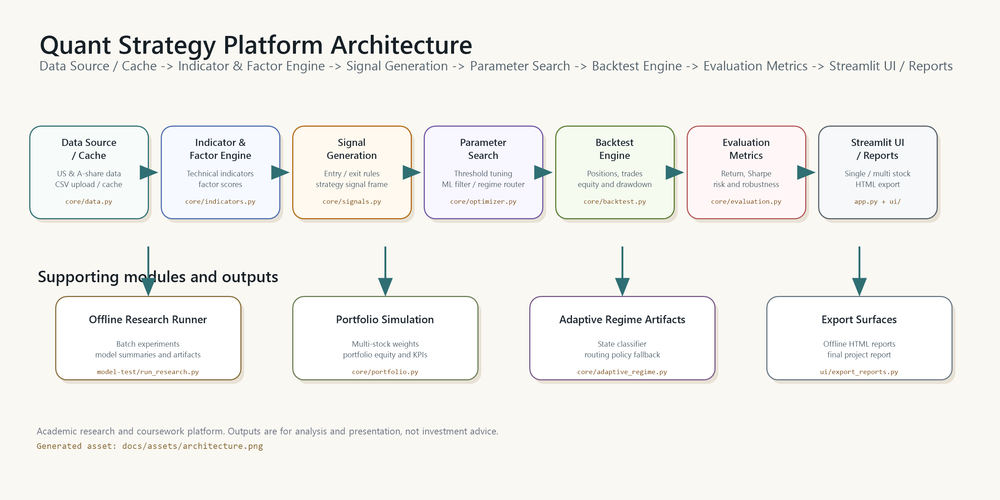

# 量化交易策略分析平台

这是一个基于 Streamlit 的模块化量化策略分析应用，用于完成美股 / A 股数据加载、指标与因子计算、策略信号生成、参数搜索、回测评估、单股工作流、多股组合分析、离线研究结果查看和 HTML 报告导出。

项目定位是课程与研究展示系统：重点是把“数据 -> 因子 -> 信号 -> 参数搜索 -> 回测 -> 评估 -> 页面展示 / 报告导出”的闭环讲清楚、跑通并留痕，不承诺实盘收益，也不构成投资建议。

## 核心能力

- **双市场数据分析**：支持美股与 A 股，内置样例 CSV，并可按需通过外部数据源拉取行情。
- **单股策略工作流**：围绕单只股票完成数据筛选、指标计算、信号生成、参数调整、回测和策略结果展示。
- **多股组合分析**：支持多标的横向比较、风险收益分析、组合模拟和权重配置。
- **策略增强模块**：包含基础规则策略、因子过滤、ML 过滤、legacy regime router 和 adaptive regime router。
- **模型评估页**：读取 `model-test/outputs/` 下的离线研究结果，展示模型排名、分段表现、失败记录和可观测性信息。
- **离线研究 runner**：`model-test/` 可批量运行单股策略研究，输出 CSV、JSON、Markdown、QuantStats 和 MLflow 相关结果。
- **HTML 报告导出**：单股、多股页面可导出离线 HTML 报告；最终提交报告位于 `reports/Final_Report.html`。

## 快速启动

### Windows 一键启动

在项目根目录执行：

```powershell
.\run.bat
```

也可以直接双击项目根目录下的 `run.bat`。脚本会自动完成：

1. 创建虚拟环境 `.venv/`
2. 安装 `requirements.txt` 中的依赖
3. 启动 Streamlit 应用

启动完成后，按终端输出的地址访问页面。本项目部署配置使用 `/strategy` 子路径，因此本地通常访问：

```text
http://localhost:8501/strategy
```

如果 Streamlit 输出了不同端口，以终端实际地址为准。

### macOS / Linux 一键启动

首次在 Mac 上参与开发时，建议通过 [Homebrew](https://brew.sh/) 安装 Git 和 Python 3.12，然后克隆仓库：

```bash
xcode-select --install
brew install git python@3.12
git clone https://github.com/rikka314/stratagy.git
cd stratagy
./run.sh
```

如果 macOS 阻止脚本执行，可先运行 `chmod +x run.sh`。脚本与 Windows 的 `run.bat` 保持相同行为：创建 `.venv/`、仅在 `requirements.txt` 变化时安装依赖，然后启动 Streamlit。只检查环境而不启动服务时使用：

```bash
./run.sh --setup-only
```

Apple Silicon 和 Intel Mac 均使用 Python 虚拟环境，不需要激活环境即可运行。如果需要指定其他 Python，可使用 `PYTHON_BIN`：

```bash
PYTHON_BIN=/opt/homebrew/bin/python3.12 ./run.sh
```

### 手动启动

macOS / Linux：

```bash
python3 -m venv .venv
./.venv/bin/python -m pip install -r requirements.txt
STRATAGY_RESEARCH_CONTROL=1 ./.venv/bin/python -m streamlit run app.py
```

Windows PowerShell：

```powershell
python -m venv .venv
.\.venv\Scripts\activate
pip install -r requirements.txt
streamlit run app.py
```

## 页面入口

| 页面 | 本地 / 部署路径 | 作用 |
|---|---|---|
| 首页 | `/strategy` | 项目入口与导航，进入单股或多股分析 |
| 单股分析 | `/strategy/stock-analysis` | 选择或上传单只股票，生成策略、回测、图表和 HTML 报告 |
| 多股分析 | `/strategy/stocks-analysis` | 组织股票池，做横向比较、组合模拟和多股报告 |
| 模型评估 | `/strategy/model-evaluation` | 查看 `model-test/outputs/` 生成的离线研究结果 |
| 最终报告 | `/strategy/final-report` | 在应用内查看 `reports/Final_Report.html` |

## 典型分析流程

### 单股策略分析

1. 进入 `/strategy/stock-analysis`。
2. 选择市场与股票，或上传符合字段要求的 CSV。
3. 设置日期范围、指标窗口、信号阈值、止损止盈、因子权重等参数。
4. 系统加载行情数据，计算技术指标和因子分数。
5. 生成策略信号，并可选择基础策略、搜索模型、ML 过滤或 regime 路由策略。
6. 运行回测，查看净值、回撤、买卖点、指标卡片和模型对比。
7. 根据需要导出单股 HTML 报告。

### 多股组合分析

1. 进入 `/strategy/stocks-analysis`。
2. 选择多个股票，或混合使用远程数据与上传 CSV。
3. 查看价格对比、相对强弱、风险收益、因子评分和相关性。
4. 设置组合权重或运行组合优化。
5. 生成组合策略结果，查看组合净值、周期收益热力图、个股贡献与风险指标。
6. 导出多股 HTML 报告。

### 离线模型研究

`model-test/` 提供不依赖 Streamlit UI 的批量研究入口，复用单股策略 pipeline。常用命令：

```powershell
python model-test/run_research.py --config model-test/configs/smoke_us_v2.json
python model-test/run_research.py --config model-test/configs/us_v2_fast.json
```

每次运行会写入 `model-test/outputs/<output_subdir>/`，主要产物包括：

- `runs.csv`
- `stocks.csv`
- `model_summary.csv`
- `segment_summary.csv`
- `robustness_summary.csv`
- `report.json`
- `report.md`
- `artifacts/`
- `regime_artifacts/`
- 可选的 QuantStats HTML 与 MLflow 文件

## 主流程架构

下图展示平台从数据输入到页面展示和报告导出的主链路：



```text
Data Source / Cache
        |
        v
Indicator & Factor Engine
        |
        v
Signal Generation
        |
        v
Parameter Search / ML Filter / Regime Router
        |
        v
Backtest Engine
        |
        v
Evaluation Metrics
        |
        v
Streamlit UI / Offline HTML Reports / Model-Test Outputs
```

对应代码位置：

- 数据加载：`core/data.py`、`core/utils.py`
- 指标与因子：`core/indicators.py`
- 信号生成：`core/signals.py`
- 参数搜索：`core/optimizer.py`
- 回测：`core/backtest.py`
- 评估：`core/evaluation.py`
- 组合模拟：`core/portfolio.py`
- 市场状态与 regime：`core/regime_model.py`、`core/adaptive_regime.py`
- 单股工作流：`ui/single_stock_workflow.py`
- 页面展示与导出：`ui/`、`ui/export_reports.py`

## 项目目录结构

```text
stratagy/
├── run.bat                   # Windows 一键安装与启动
├── app.py                    # Streamlit 路由壳层和页面入口
├── requirements.txt          # Python 依赖
├── core/                     # 数据、指标、信号、回测、评估、优化、组合、regime
├── ui/                       # 首页、单股、多股、模型评估、主题、HTML 导出
├── data/                     # 本地样例与缓存股票 CSV
├── model-test/               # 离线策略研究 runner、配置和输出
├── reports/                  # 最终 HTML 报告与后续导出物
├── document/                 # 接口文档、风格标准、验收记录、限制说明
├── deploy/                   # 部署脚本与 Nginx 子路径配置
├── scripts/                  # 本地 setup/start、打包和工具脚本
├── tests/                    # Pytest 测试套件
├── plan/                     # 学期计划与执行计划
├── .streamlit/               # Streamlit 配置，包含 baseUrlPath
└── AI_CONTEXT.md             # 项目级上下文与模块索引
```

## 数据与上传要求

- `data/` 目录包含本地样例与缓存股票数据。
- 远程行情、指数、推荐股票和部分市场快照依赖 AkShare 等外部数据源。
- 上传数据以 CSV 为主，需要能标准化为以下核心字段：

```text
date, open, high, low, close, volume
```

字段缺失或数据为空时，页面不会进入完整策略链路。

## 打包与部署

生成课程提交 ZIP：

```powershell
powershell -ExecutionPolicy Bypass -File .\scripts\prepare_final_zip.ps1 -GroupNumber 01
```

常用部署信息：

| 项目 | 值 |
|---|---|
| 公开路径 | `/strategy` |
| Streamlit 配置 | `.streamlit/config.toml` |
| 服务器目录 | `/opt/stratagy` |
| 增量同步 | `deploy/sync.bat` |
| 全量上传 | `deploy/upload_and_deploy.bat` |
| Nginx 模板 | `deploy/nginx_strategy.conf` |

## 已知限制

- 本项目用于课程和研究展示，不是实盘交易系统，不提供投资建议。
- 外部行情、指数与推荐股票数据依赖网络和上游接口；接口波动、限流或字段变化时，页面可能显示 `N/A` 或降级结果。
- 服务器不作为长期全量股票 CSV 仓库，默认按需拉取或使用临时缓存。
- 上传入口目前以 CSV 为主，且必须满足核心行情字段要求。
- `/strategy/model-evaluation` 依赖本地或服务器上已有的 `model-test/outputs/` 输出物；没有生成或同步的研究结果不会显示。
- Adaptive Router V1 依赖离线生成的 `regime_artifacts/`；缺失或损坏时会降级到 legacy dual-state router。
- `/strategy` 子路径部署依赖 `app.py`、`.streamlit/config.toml` 和 `deploy/nginx_strategy.conf` 保持一致，单独修改其中一处可能导致刷新或直达链接异常。

## 参考文档

- `AI_CONTEXT.md`：项目模块地图与当前稳定事实
- `document/MODULE_INTERFACES.md`：模块接口总索引
- `document/interfaces/strategy-pipeline.md`：策略主链路接口
- `document/interfaces/single-stock-workflow.md`：单股 workflow 与 artifact 约定
- `document/interfaces/multi-stock-portfolio.md`：多股组合接口
- `document/interfaces/deploy-runtime.md`：部署与子路径运行约定
- `document/KNOWN_LIMITATIONS.md`：已知限制清单
- `model-test/docs/README.md`：离线研究 runner 说明
