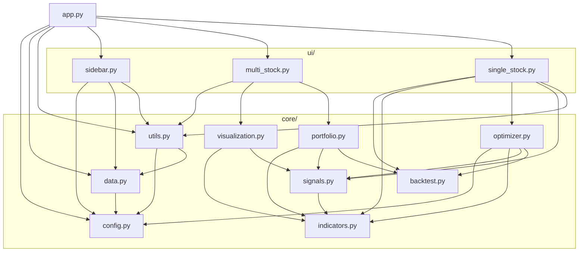

# 模块接口梳理（Week 1 · Day 2 产出）

> 梳理时间：2026-03-19
> 目的：理清现有代码的接口边界、依赖方向和 8 周改动范围

---

## 1. 核心模块接口

### core/data.py — 5 个函数

| # | 函数签名 | 输入 | 输出 |
|---|---------|------|------|
| 1 | `standardize_columns(df: DataFrame)` | 任意列名的 df | 列名小写化+映射后的 df |
| 2 | `ensure_date_column(df: DataFrame)` | df | date 列转 datetime64+排序后的 df |
| 3 | `fetch_data(symbol: str, adjust: str)` | 美股代码+复权方式 | 标准化 OHLCV df |
| 4 | `load_csv(path: str)` | 本地 CSV 路径 | 标准化 df（缓存 1h） |
| 5 | `load_uploaded_bytes(data: bytes)` | 上传字节流 | 标准化 df |

- **输出标准列**：`date`(datetime64), `open`(float64), `high`(float64), `low`(float64), `close`(float64), `volume`(float64)
- **当前列名映射**：`trade_date→date`, `datetime→date`, `vol→volume`, `volumn→volume`
- **A 股接入影响点**：`fetch_data` 需加 A 股路径，`standardize_columns` 需扩展中文列名映射

---

### core/indicators.py — 9 个单指标函数 + 1 个汇总函数

单指标函数（纯计算，无副作用，无 core 内部依赖）：

| # | 函数 | 输入 | 输出 |
|---|------|------|------|
| 1 | `compute_rsi(series, period=14)` | close Series | RSI Series (0-100) |
| 2 | `rolling_zscore(series, window)` | 任意 Series | Z-score Series |
| 3 | `rolling_percentile(series, window)` | 任意 Series | 分位数 Series (0-1) |
| 4 | `compute_macd(series, fast, slow, signal)` | close Series | (macd, signal, histogram) |
| 5 | `compute_atr(df, period)` | 含 high/low/close 的 df | ATR Series |
| 6 | `compute_adx(df, period)` | 含 high/low/close 的 df | ADX Series |
| 7 | `compute_bollinger_bands(series, period, std_dev)` | close Series | (upper, middle, lower) |
| 8 | `compute_obv(df)` | 含 close/volume 的 df | OBV Series |
| 9 | `rolling_rank(series, window)` | 任意 Series | 排名 Series (0-1) |

汇总函数：

```
add_indicators(df, rsi_period, macd_fast, macd_slow, macd_signal,
               ema_fast, ema_slow, adx_period, atr_period,
               bb_period=20, bb_std=2.0, indicator_period=20) -> DataFrame
```

- **输入要求**：df 须含 `close`, `high`, `low`, `volume`
- **新增 18 列**：rsi, macd, signal, histogram, ema_fast, ema_slow, atr, adx, bb_upper, bb_middle, bb_lower, bb_position, bb_width, obv, obv_trend, volume_ratio, drawdown, price_position
- **8 周改动**：不需改，市场无关

---

### core/signals.py — 1 个核心函数（29 个参数）

```
compute_signals(df,
    # 必传 15 个
    rsi_lower, rsi_upper, adx_threshold,
    momentum_short, momentum_long, score_lookback,
    score_mid_pct, score_high_pct,
    weight_mom_short, weight_mom_long, weight_macd, weight_rsi, weight_vol,
    entry_threshold, exit_threshold,
    # 可选 14 个（均有默认值）
    use_trend_filter=True, use_strength_filter=True,
    use_rsi_filter=True, use_macd_filter=True,
    weight_bb=0.8, weight_obv=1.0, weight_volume=0.6,
    weight_price=0.7, weight_drawdown=0.5,
    use_voting_entry=False, entry_vote_threshold=2.5,
    exit_min_signals=2, entry_min_signals=3
) -> DataFrame
```

- **输入要求**：df 须已过 `add_indicators`
- **关键输出列**：`target_position`(float 0-1), `buy_signal`(bool), `sell_signal`(bool), `factor_score`, `factor_percentile`
- **8 周改动**：不改（市场无关）；W6 若加新策略模式可能扩展

---

### core/backtest.py — 4 个函数

| # | 函数 | 输入 | 输出 |
|---|------|------|------|
| 1 | `simulate_strategy(df, initial_position=0, stop_loss_mult=0.0, take_profit_mult=0.0)` | 含 close/atr/target_position 的 df | 原 df + position, strategy_return, strategy_equity, buy_hold_equity |
| 2 | `max_drawdown(equity: Series)` | 权益曲线 | 负数浮点 |
| 3 | `sharpe_ratio(returns: Series)` | 日收益率 | 年化夏普比率 |
| 4 | `walk_forward_backtest(df, train_window, test_window, stop_loss_mult, take_profit_mult)` | 含信号的 df | (结果汇总表, 拼接净值曲线) |

- `simulate_strategy` 支持两种模式：有 `target_position` 用动态仓位，否则用 buy/sell_signal 二元持仓
- **8 周改动**：W3 微调评估输出格式

---

### core/optimizer.py — 4 个函数

| # | 函数 | 输入 df 类型 | 搜索参数数 | 特色 |
|---|------|------------|-----------|------|
| 1 | `evaluate_presets_for_optimization(df_raw, split_idx, ...)` | 原始 df | 评估 3 组预设 | 热启动选最佳起点 |
| 2 | `random_search_params(df_raw, split_idx, n_trials, ...)` | 原始 df | 23 个 | 热启动 + 防过拟合 |
| 3 | `bayesian_optimize_params(df_raw, split_idx, n_trials, ...)` | 原始 df | 23 个 | Optuna + 热启动 |
| 4 | `genetic_algorithm_optimize_params(df_raw, split_idx, ...)` | 原始 df | 23 个 | 多核并行 + 精英保留 |

- 三种方法接口已统一：均接收 `df_raw` + 内部调 `add_indicators`，支持 `seed_params` 热启动，结果含 `_method` 标识
- 共同机制：70/30 子验证拆分、目标 = 0.4×训练 + 0.6×验证 - 0.3×|gap| - L2 正则化
- **8 周改动**：不改

---

## 2. 模块依赖图

### import 级别真实依赖

```
core/ 内部：
config          → (无 core 依赖)
data            → config
indicators      → (无 core 依赖)
signals         → indicators
backtest        → (无 core 依赖)
utils           → config, data
visualization   → indicators, signals
portfolio       → indicators, signals, backtest
optimizer       → config, indicators, signals, backtest

ui/ → core：
sidebar         → config, data, utils
multi_stock     → utils, visualization, portfolio
single_stock    → backtest, indicators, optimizer, signals, utils

app.py          → config, data, utils → ui/sidebar, ui/multi_stock, ui/single_stock
```

### 数据流 vs import 依赖

- **数据流**（DataFrame 传递顺序）：`fetch_data → add_indicators → compute_signals → simulate_strategy`
- **import 依赖**：`backtest` 和 `indicators` 互不依赖，均为叶子节点
- `optimizer`、`visualization`、`portfolio` 是"消费者"，内部完整调用管道

### Mermaid 图



---

## 3. 各模块 8 周改动范围

| 模块 | W1 | W2 | W3 | W4 | W5 | W6 | W7 | W8 |
|------|:--:|:--:|:--:|:--:|:--:|:--:|:--:|:--:|
| `config.py` | — | **改** | — | — | — | **改** | — | — |
| `data.py` | — | **改** | — | — | — | — | — | — |
| `indicators.py` | — | — | — | — | — | — | — | — |
| `signals.py` | — | — | — | — | — | 可能 | — | — |
| `backtest.py` | — | — | 微调 | — | — | — | — | — |
| `optimizer.py` | 已修 | — | — | — | — | — | — | — |
| `utils.py` | — | **改** | — | — | — | — | — | — |
| `visualization.py` | — | — | — | — | — | — | **改** | — |
| `portfolio.py` | — | — | — | — | — | — | — | — |
| **新** `evaluation.py` | — | — | **新建** | — | — | — | **增强** | — |
| **新** `ml_filter.py` | — | — | — | **新建** | **迭代** | — | — | — |
| **新** `strategy_modes.py` | — | — | — | — | — | **新建** | — | — |
| `sidebar.py` | — | **改** | — | — | — | **改** | — | — |
| `single_stock.py` | — | — | **改** | **改** | **改** | **改** | **改** | fix |
| `multi_stock.py` | — | — | — | — | — | — | **改** | fix |
| `app.py` | — | 微调 | — | 微调 | — | — | — | — |

### W2 改动明细

- `config.py`：加 A 股默认股票列表 + 市场选择常量
- `data.py`：加 `fetch_a_stock()`（调 `ak.stock_zh_a_hist`）+ 扩展 `standardize_columns` 中文列名映射
- `utils.py`：`load_or_fetch_stock` 加市场参数分发
- `sidebar.py`：加"美股/A股"市场选择控件 + A 股代码输入逻辑
- `app.py`：路由层传递市场参数

### W3 改动明细

- `backtest.py`：统一评估输出格式（确保下游 evaluation.py 可直接消费）
- **新建** `evaluation.py`：累计收益、年化收益、最大回撤、夏普、胜率、盈亏比、换手率 + 策略 vs 基准对比
- `single_stock.py`：嵌入评估区块（净值曲线、回撤曲线、统计表）

### W4 改动明细

- **新建** `ml_filter.py`：特征构建 + Logistic/LightGBM 训练 + 预测 + 时间切分验证
- `single_stock.py`：ML 开关 + 过滤前后对比 + 特征重要性展示
- `app.py`：ML 相关 session_state

### W5 改动明细

- `ml_filter.py`：滚动训练/验证 + 阈值控制 + 误判分析
- `single_stock.py`：ML 对比展示增强

### W6 改动明细

- `config.py`：新策略模式预设参数
- **新建** `strategy_modes.py`：轻量策略（如均线趋势+波动过滤或均值回归+RSI/BB）
- `signals.py`：可能扩展以支持新模式
- `sidebar.py`：策略模式切换 + ML 开关
- `single_stock.py`：首页摘要卡 + 模式切换 UI

### W7 改动明细

- `evaluation.py`：增强版（分区间表现、参数对比、策略版本对比）
- `visualization.py`：图表风格统一（配色、字体、边距、图例）
- `single_stock.py` / `multi_stock.py`：配色统一、空状态提示、加载动画

### W8 改动明细

- 全模块 bugfix，不新增功能
- `single_stock.py` / `multi_stock.py`：修复联调问题

---

## 4. 本次代码修复记录（W1 Day 2）

### 问题：`random_search_params` 接口不一致

| 维度 | 修复前 | 修复后 |
|------|--------|--------|
| 输入 df | `df_indicators`（已加指标） | `df_raw`（原始数据） |
| 搜索参数数 | 5 个 | 23 个（与贝叶斯/遗传对齐） |
| 热启动 | 不支持 | 支持 `seed_params` |
| 预设评估 | 跳过 | 同样执行 |
| 目标函数 | 缺 `max_drawdown` 惩罚 | 加入 `abs(dd) * 0.5` 惩罚 |
| 方法标识 | 无 | `_method: "random_search"` |

涉及文件：
- `core/optimizer.py`：重写 `random_search_params`
- `core/optimizer.py`：`bayesian_optimize_params` 结果加 `_method: "bayesian"`
- `ui/single_stock.py`：调用方式对齐 + 启用预设评估 + 方法检测改用 `_method` 字段
- `AI_CONTEXT.md`：修正依赖链描述 + 更新优化器说明
