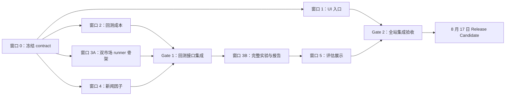

# Dean's Award 独立改造计划

> 制定日期：2026-08-03  
> 假定提交截止：2026-08-23  
> 项目改造冻结日：2026-08-17  
> 材料专用时间：2026-08-18 至 2026-08-22（完整预留 5 天）

## 1. 本轮目标

把当前“功能较完整的量化课程项目”升级成一个能够清楚回答以下问题的研究型作品：

1. 用户能否快速理解项目解决什么问题、如何开始分析、如何读取结果？
2. 在统一且可信的样本外实验口径下，哪些策略更适合美股，哪些策略更适合中国 A 股？
3. 新闻情绪是否带来稳定增量，还是只在特定市场、标的或市场状态下有效？
4. 结论能否被复现、解释，并通过网页、报告和演示视频直接展示？

本轮不追求新增大量模型。优先顺序是：

`研究可信度 > 核心流程稳定 > 结论可解释 > UI 表达 > 装饰性功能`

## 2. 当前基线与必须解决的问题

### 已有基础

- Streamlit 已有首页、单股入口、多股入口、单股/多股分析页和模型评估页。
- 美股与 A 股的在线数据加载、搜索和分析入口已经存在。
- 单股 `search` 路径已支持 `News Fusion`：`SM/FSM -> Parameter Search -> News Fusion -> ML Filter`。
- `model-test` 已支持模型汇总、rolling robustness、adaptive regime、MLflow、QuantStats 和只读评估页。
- 当前正式备份已保存在 `D:\Learn\20_Projects\stratagy_final_submission_backup_20260803.zip`。

### 当前缺口

1. `model-test/model_test/config.py` 仍明确限制 `market == "US"`，A 股无法进入同一离线研究框架。
2. `core/backtest.py` 当前按持仓乘日收益计算，没有扣除交易成本，也没有市场专属执行约束；直接比较两个市场会削弱结论可信度。
3. 新闻融合已经接入线上 workflow，但缺少双市场覆盖率、无新闻回退、时点无泄漏和权重消融实验的完整证据。
4. 当前工作区有一项未提交修复：`core/news_factor.py` 的无新闻行仓位回填；新闻窗口必须保留该修改。
5. `.venv` 与 `.venv_sys` 当前都没有 `pytest`，尚不能建立可重复测试基线。
6. UI 已有统一视觉方向，但单股分析页仍非常长，策略配置、实验结果与解释信息的阅读成本较高。

## 3. 范围与优先级

### P0：必须在 8 月 14 日前完成

- 建立可运行的测试环境并记录基线。
- 冻结双市场实验口径：样本、时间切分、成本、指标、候选策略和胜出规则。
- 让离线 runner 支持 `US` 与 `CN_A`，至少完成双市场 smoke run。
- 完成新闻覆盖率检查与新闻融合消融实验。
- 完成首页/入口页和策略实验主流程的关键 UI 优化。
- 生成可机器读取的双市场比较结果与一份可读报告。

### P1：必须在 8 月 17 日前完成

- 模型评估页展示市场策略推荐、证据和限制。
- 完成核心回归测试、桌面/移动端视觉检查、线上 smoke test。
- 冻结 release candidate，生成最终 ZIP、版本号、结果清单和已知限制。

### P2：只有 P0/P1 全部稳定后才做

- 更复杂的动画、深色主题或第二轮装饰性打磨。
- 实时新闻抓取服务。
- 新的深度学习、强化学习或复杂集成模型。
- 大规模全市场参数搜索。

## 4. 实验研究设计

### 4.1 研究问题

- RQ1：在相同样本外评估框架下，各策略在美股和 A 股的风险调整后表现是否不同？
- RQ2：新闻融合相对同一基础策略是否有稳定增量？
- RQ3：策略优势是否在多个时间窗口、多个标的和不同市场状态下保持？
- RQ4：扣除市场对应交易成本后，结论是否仍成立？

### 4.2 候选策略

共同候选集用于公平跨市场比较：

- `Naive`：买入并持有。
- `Mean`、`Drift`：简单基线。
- `SM`、`FSM`：现有规则/因子策略。
- `SM/FSM + Search`：从 Bayesian、Random、Genetic 中按既有公平预算选出代表。
- `SM/FSM + ML Filter`：Logistic 与 LightGBM。
- `SM/FSM + News Fusion`：仅在新闻覆盖达到阈值的匹配样本中比较。

市场专属候选可单独展示，但不能冒充共同候选的公平比较：

- 美股：legacy/adaptive regime 路径。
- A 股：只有在市场代理、数据和 artifact 均验证完成后才纳入 regime；否则明确标为本轮未覆盖。

### 4.3 样本与切分

- 每个市场先做 6–10 只股票 smoke pool，再扩展到 12–24 只分层股票池。
- 股票池至少覆盖多个行业、不同波动和趋势分段，不能只选知名上涨股。
- 统一使用按日期切分的 train/test 与 rolling windows；严禁随机打乱时间序列。
- 新闻因子必须遵守信息可用时点；默认至少滞后一交易日，除非数据提供了可验证的盘中时间戳。
- 新闻实验使用“有足够新闻覆盖的匹配样本”，并同时报告覆盖率，不能把缺失新闻当作中性新闻后直接宣布有效。

### 4.4 市场公平性

实验配置必须显式记录：

- `market`
- 调整方式与数据源
- 交易成本/滑点参数
- 基准与市场代理
- 股票池和筛选理由
- 时间范围与每个 rolling window
- 随机种子、搜索预算、代码版本

最低实现是为两个市场提供可配置的成本模型，并把成本计入策略收益和逐笔交易结果。更复杂的市场交易规则若无法在期限内完整模拟，应写入限制，不用半成品规则制造虚假精度。

### 4.5 胜出规则

“最适合某市场”不能等同于单次总分第一。推荐结论必须同时满足：

1. 样本外综合分位于该市场前列。
2. rolling windows 的排名和方向基本稳定。
3. 扣除成本后仍保持正向增量。
4. 相对 `Naive` 的胜出率和中位超额收益合理。
5. 成功率、降级率和数据覆盖达到阈值。
6. 若两个策略差异不足以形成稳健结论，输出“并列/证据不足”，而不是强行选一个冠军。

### 4.6 新闻消融矩阵

固定同一基础策略、样本和时间切分，至少比较：

| 组别 | 新闻权重 | Lookback | 用途 |
|---|---:|---:|---|
| Base | 0.00 | 固定 | 无新闻基线 |
| Low | 0.15 | 3/5 | 检查轻量增量 |
| Medium | 0.30 | 3/5 | 主实验 |
| High | 0.45 | 3/5 | 检查过度依赖新闻 |

输出必须包含：覆盖率、匹配行数、收益/回撤/Sharpe/换手变化、稳定性、无新闻回退是否保持原策略仓位。

### 4.7 最终研究产物

- `market_strategy_matrix.csv`：市场 × 策略核心指标。
- `market_strategy_recommendations.json`：推荐策略、证据、置信级别、限制。
- `news_ablation_summary.csv`：新闻权重/窗口消融结果。
- `data_manifest.json`：数据源、范围、股票池、版本和运行参数。
- `market_strategy_report.md`：可直接转入项目介绍的研究结论。
- 两个独立 run：US 与 CN_A，保留各自的 `report.json`、失败记录和 robustness 输出。

## 5. 多窗口分工

### 窗口 0：总控、接口冻结与集成

**角色：** 唯一集成窗口。负责边界、合并顺序、共享文档和最终验收，不在并行期抢改子窗口文件。

**独占文件：**

- `plan/deans_award_upgrade_20260803.md`
- `AI_CONTEXT.md`
- `README.md`
- `document/interfaces/*.md`
- 最终发布清单和跨窗口整合修改

**任务：**

| ID | 子任务 | 预计 |
|---|---|---:|
| 0.1 | 建立 `requirements-dev.txt` 或等价开发环境，安装/锁定 pytest，运行全量测试基线 | 1–2h |
| 0.2 | 冻结市场枚举、成本配置、实验输出 JSON/CSV contract | 2–3h |
| 0.3 | 为每个窗口记录允许修改文件、依赖版本和验收命令 | 1h |
| 0.4 | 完成 Gate 1/Gate 2 集成，处理接口冲突 | 3–5h |
| 0.5 | 更新 README、接口文档、AI_CONTEXT 与已知限制 | 2–3h |
| 0.6 | 运行最终验收、部署 smoke test、打包 release candidate | 3–4h |

**产出物：** 可运行主分支、接口文档、测试记录、最终 ZIP 和 release checklist。

### 窗口 1：UI 信息架构与入口体验

**使用 skill：** `strategy-frontend`

**独占文件：**

- `ui/theme.py`
- `ui/home.py`
- `ui/single_stock_entry.py`
- `ui/multi_stock_entry.py`
- `app.py`
- `ui/i18n.py`（本轮新增/调整文案统一由此窗口处理）
- 对应前端测试文件

**禁止修改：** `core/`、`model-test/`、`ui/model_evaluation.py`、接口文档。

| ID | 子任务 | 预计 |
|---|---|---:|
| 1.1 | 记录首页、单股入口、多股入口的桌面/移动端现状截图与问题清单 | 1–2h |
| 1.2 | 收敛 shared tokens、按钮、状态提示和响应式间距，清除局部视觉语言冲突 | 3–4h |
| 1.3 | 优化首页叙事：项目问题、双市场、策略实验、两个主 CTA 一屏可理解 | 2–3h |
| 1.4 | 优化单股/多股入口逻辑：市场→标的→数据→开始分析的操作顺序一致 | 3–4h |
| 1.5 | 完成 loading/empty/error/missing-field 状态与移动端检查 | 2–3h |
| 1.6 | 更新前端测试并输出 before/after 截图 | 2–3h |

**验收：** 不出现默认 Streamlit 蓝按钮；桌面和窄屏无重叠；推荐行文字与按钮对齐；核心路由和 route state 不变。

### 窗口 2：双市场回测可信度

**使用 skill：** `strategy-core-pipeline`

**独占文件：**

- `core/backtest.py`
- 可新增 `core/market_rules.py`
- 对应 backtest/market-rules 测试

**禁止修改：** `ui/`、`model-test/`、共享接口文档。

| ID | 子任务 | 预计 |
|---|---|---:|
| 2.1 | 设计向后兼容的 `MarketExecutionConfig`/费用 contract，默认行为保持旧结果 | 2–3h |
| 2.2 | 将佣金/滑点等可配置成本计入每日策略收益和交易明细 | 3–4h |
| 2.3 | 增加换手、总成本、净收益等可汇总字段 | 2–3h |
| 2.4 | 覆盖零成本兼容、开仓/平仓、动态仓位和连续调仓测试 | 3–4h |
| 2.5 | 向总控提交接口差异说明与市场默认值建议，不直接改共享文档 | 1h |

**验收：** 零成本配置与旧行为数值一致；成本只在仓位变化时产生；测试覆盖多次调仓；不破坏 `ModelResult` 下游消费者。

### 窗口 3：双市场离线研究框架

**使用 skill：** `strategy-core-pipeline`

**独占文件：**

- `model-test/model_test/config.py`
- `model-test/model_test/models.py`
- `model-test/model_test/universe.py`
- `model-test/model_test/runner.py`
- `model-test/model_test/execution.py`
- `model-test/model_test/summarize.py`
- `model-test/model_test/reporting.py`
- `model-test/configs/*deans*.json`
- `tests/test_model_test_runner.py` 及新增 runner 测试

**禁止修改：** `core/backtest.py`、`core/news_factor.py`、`ui/`、共享接口文档。

| ID | 子任务 | 预计 |
|---|---|---:|
| 3.1 | 移除 US-only 硬限制，建立 `US/CN_A` 规范化和市场专属默认配置 | 2–3h |
| 3.2 | 扩展 A 股股票池、symbol/CSV 缓存路径、成交额筛选与 smoke symbols | 4–5h |
| 3.3 | 配置市场代理、候选策略支持矩阵和不支持时的明确 skipped 原因 | 3–4h |
| 3.4 | 接入窗口 2 的成本 contract，并写入 config snapshot/data manifest | 2–3h |
| 3.5 | 生成 US/CN_A smoke config，完成双市场 smoke run | 3–4h |
| 3.6 | 生成跨市场比较矩阵、推荐 JSON 和报告 Markdown | 4–6h |
| 3.7 | 补充 runner、配置、报告和失败降级测试 | 3–4h |

**验收：** 两个市场均可从 config 启动；输出结构一致；不支持的模型被明确标记而非静默失败；同一 run 可复现。

### 窗口 4：新闻情绪数据与消融实验

**使用 skill：** `strategy-core-pipeline`

**独占文件：**

- `core/news_factor.py`
- `tests/test_news_factor.py`
- 可新增独立新闻数据校验/实验辅助模块，但不得修改 `model-test/model_test/*`
- 新闻数据 schema/样例说明文件

**必须保留：** 当前无新闻行 `target_position` 按布尔掩码回填的未提交修复。

| ID | 子任务 | 预计 |
|---|---|---:|
| 4.1 | 冻结新闻 CSV schema、US/CN_A symbol 规范化和交易日对齐规则 | 2–3h |
| 4.2 | 增加覆盖率、缺失率、重复行、未来时点/异常值检查 | 3–4h |
| 4.3 | 验证无新闻回退、权重为 0、极端情绪、缺失文件和重复新闻 | 2–3h |
| 4.4 | 加入防未来泄漏的滞后配置，并记录有效信息日期 | 2–3h |
| 4.5 | 按权重 × lookback 运行小规模消融并生成 `news_ablation_summary.csv` | 4–6h |
| 4.6 | 向窗口 3 提交稳定 API、参数和输出字段，不直接修改 runner | 1h |

**验收：** 新闻为 0 或缺失时不改变上游策略；结果包含覆盖率；消融使用相同基础策略和样本；不能使用未来新闻。

### 窗口 5：研究结果展示与解释

**启动条件：** 窗口 3 冻结 `market_strategy_recommendations.json` 和报告字段后再开始。

**使用 skill：** `strategy-frontend`

**独占文件：**

- `ui/model_evaluation.py`
- `core/visualization.py`
- `ui/export_reports.py`（仅本窗口可改）
- `tests/test_model_evaluation_page.py`
- 对应可视化/导出测试

**禁止修改：** `ui/theme.py`、`ui/i18n.py`、runner 和核心策略文件。新增文案键提交给窗口 1/总控统一落地。

| ID | 子任务 | 预计 |
|---|---|---:|
| 5.1 | 用 fixture/mock 先实现市场推荐数据适配层和缺失字段回退 | 2–3h |
| 5.2 | 增加“US vs CN_A”策略矩阵、推荐证据、置信级别和限制区 | 3–4h |
| 5.3 | 增加新闻消融对比图与覆盖率提示 | 2–3h |
| 5.4 | 优化评估页层级：结论→证据→稳健性→失败/限制 | 3–4h |
| 5.5 | 将核心研究结论接入 HTML 导出 | 2–3h |
| 5.6 | 补充空态、旧 report 兼容、异常 payload 和视觉回归测试 | 3–4h |

**验收：** 页面先给结论再给表格；旧 `report.json` 仍能打开；没有跨市场输出时正常空态；推荐结论可追溯到指标和样本。

## 6. 依赖与启动顺序



可同时开始：窗口 1、窗口 2、窗口 3 的配置/股票池骨架、窗口 4。  
必须等待：窗口 3 的正式实验需等待窗口 2 成本接口和窗口 4 新闻接口；窗口 5 需等待窗口 3 报告 contract。

## 7. 日期安排

| 日期 | 阶段 | 里程碑 |
|---|---|---|
| 8/3 | 规划 | 备份完成、范围和窗口计划冻结 |
| 8/4 | Gate 0 | 测试环境、基线结果、实验 contract、文件所有权冻结 |
| 8/5–8/8 | 并行开发 I | 窗口 1/2/3A/4 同时推进 |
| 8/9 | 子窗口自验 | 各窗口提交测试结果、接口差异、产物清单 |
| 8/10 | Gate 1 | 成本、双市场 runner、新闻接口集成；跑 US/CN_A smoke |
| 8/11–8/13 | 并行开发 II | 正式实验运行；窗口 1 收口；窗口 5 开始展示层 |
| 8/14 | 研究冻结 | 冻结策略矩阵、新闻消融、推荐结论和失败清单 |
| 8/15 | Gate 2 | 全量测试、UI 桌面/移动 QA、报告导出、线上部署 |
| 8/16 | 修复日 | 只修 P0/P1 缺陷，不新增功能 |
| 8/17 | RC 冻结 | 最终 smoke、版本 ZIP、SHA-256、回滚包、材料数据源清单 |
| 8/18–8/22 | 其他材料 | ≤10 页项目介绍、演示视频、网站上传、答辩/提交检查 |
| 8/23 | 提交 | 仅提交与应急，不再主动改代码 |

## 8. Gate 验收标准

### Gate 0：可以并行开发

- pytest 可运行，并记录通过/失败/跳过数量。
- 当前 `core/news_factor.py` 修改已明确归属窗口 4。
- 市场枚举、成本参数和实验输出 schema 已冻结。
- 每个窗口确认只修改自己的文件集合。

#### Gate 0 执行记录（2026-08-03）

- 开发测试依赖固定在 `requirements-dev.txt`（`pytest==8.4.1`）；使用
  `\.venv\Scripts\python.exe -m pip install -r requirements-dev.txt` 安装。
- 跨窗口的 `US` / `CN_A` 枚举、执行成本口径、研究输出 schema 和文件所有权，
  以 `document/interfaces/deans-award-research-contract.md` 为唯一来源。
- 全量 pytest 基线与 Gate 决定记录在
  `document/acceptance/gate_0_20260803.md`；只有记录完成后才允许启动并行窗口。
- 工作区原有的 `core/news_factor.py` 未提交修复由窗口 4 独占；Gate 0 不修改该文件。

### Gate 1：可以跑正式实验

- 零成本回测保持旧结果。
- US/CN_A smoke run 均能生成可读 `report.json`。
- 新闻缺失不会改变原策略，新闻覆盖率可计算。
- 所有实验配置包含代码版本、数据范围、成本和 seed。

### Gate 2：可以冻结发布

- 核心测试通过；无 P0/P1 已知回归。
- 首页、单股、多股、评估四条路由桌面/移动端可用。
- 双市场推荐能够回溯到具体实验结果。
- 旧报告兼容，外部数据失败时有降级页面。
- 线上 `/strategy` 及三个子路由通过 smoke test。

### Release Candidate

- 代码 ZIP、研究输出 ZIP、SHA-256 和回滚包齐全。
- README、方法说明、已知限制和运行命令准确。
- 材料引用的每个数字都能在 CSV/JSON 中找到来源。
- 8 月 18 日之后原则上不再修改代码。

## 9. 建议新增的改进点

除 UI、新闻和市场策略选择外，本轮最值得增加的是：

1. **回测可信度（P0）**：成本、时序无泄漏、市场专属配置；这是 Dean's Award 评审最容易看出研究深度的地方。
2. **可复现性（P0）**：一条命令运行 smoke/full 实验，保存 config、seed、data manifest、代码版本和失败记录。
3. **结论可解释性（P1）**：网页不只显示“第 1 名”，还显示为何推荐、在哪些窗口有效、何时不建议使用。
4. **数据质量与降级（P1）**：新闻覆盖率、行情缺失、外部接口失败必须可见，不能静默生成看似完整的结果。
5. **奖项叙事闭环（P1）**：首页和材料统一成“问题→方法→双市场实验→结论→局限→演示”的故事。
6. **演示可靠性（P1）**：准备本地缓存/固定研究输出，即使现场网络或 AkShare 不稳定，也能完整展示。

## 10. 裁剪规则

若进度落后，按以下顺序裁剪：

1. 先裁剪动画、深色主题和第二轮视觉打磨。
2. 再缩小股票池与搜索预算，但保留两个市场和 rolling windows。
3. 再将 A 股 regime 标为不支持，只比较共同候选策略。
4. 再减少新闻权重/窗口组合，但保留 Base 与一个主实验组。
5. 不裁剪：成本口径、样本外验证、双市场 smoke、结果可追溯、5 天材料时间。

## 11. AI 工具分配建议

| 工具/窗口 | 用量 | 最适合任务 |
|---|---|---|
| Codex 主控窗口 | 高 | 接口冻结、Git 状态、合并、测试与发布 |
| Codex UI 窗口 | 高 | 多文件 Streamlit/UI 修改、浏览器视觉 QA |
| Codex 核心窗口 | 高 | backtest、runner、新闻模块和测试 |
| GPT-5 第二意见 | 中 | 检查实验设计、胜出规则和是否过度宣称 |
| Gemini | 低 | 最终一次性阅读长报告，检查材料与代码结论是否一致 |
| DeepSeek | 中 | 中文项目介绍初稿、视频讲稿和表述压缩；只能使用已冻结数据 |

可并行外包比例约 65%；接口冻结、跨窗口集成和最终结论必须保留在总控窗口。

## 12. 给每个新窗口的统一开场指令

```text
先读项目 AGENTS.md、AI_CONTEXT.md，以及计划文件
plan/deans_award_upgrade_20260803.md。

你负责“窗口 X”。只修改该窗口列出的独占文件，不修改其他窗口文件、
AI_CONTEXT.md、README.md 或共享接口文档。保留现有未提交修改。

开始前先报告：
1. 你将修改的文件；
2. 输入/输出 contract；
3. 验收命令；
4. 是否依赖其他窗口。

结束时报告：
1. 已完成任务 ID；
2. 修改文件清单；
3. 测试结果；
4. 接口差异；
5. 未完成项和风险。
```

## 13. 风险提示

- **最大技术风险：** A 股离线 runner 与市场代理/数据源的差异超出预期。应先完成 6–10 只股票 smoke，不要一开始跑大股票池。
- **最大研究风险：** 反复调参直到得到想要的冠军。先冻结胜出规则和预算，允许输出“证据不足”。
- **最大协作风险：** 多窗口同时编辑 `ui/theme.py`、`core/backtest.py`、runner 或接口文档。必须遵守独占文件表，由窗口 0 统一整合。
- **最大时间风险：** 正式实验过晚启动。8 月 10 日必须完成 smoke，8 月 14 日无论结果是否理想都冻结研究结论。
